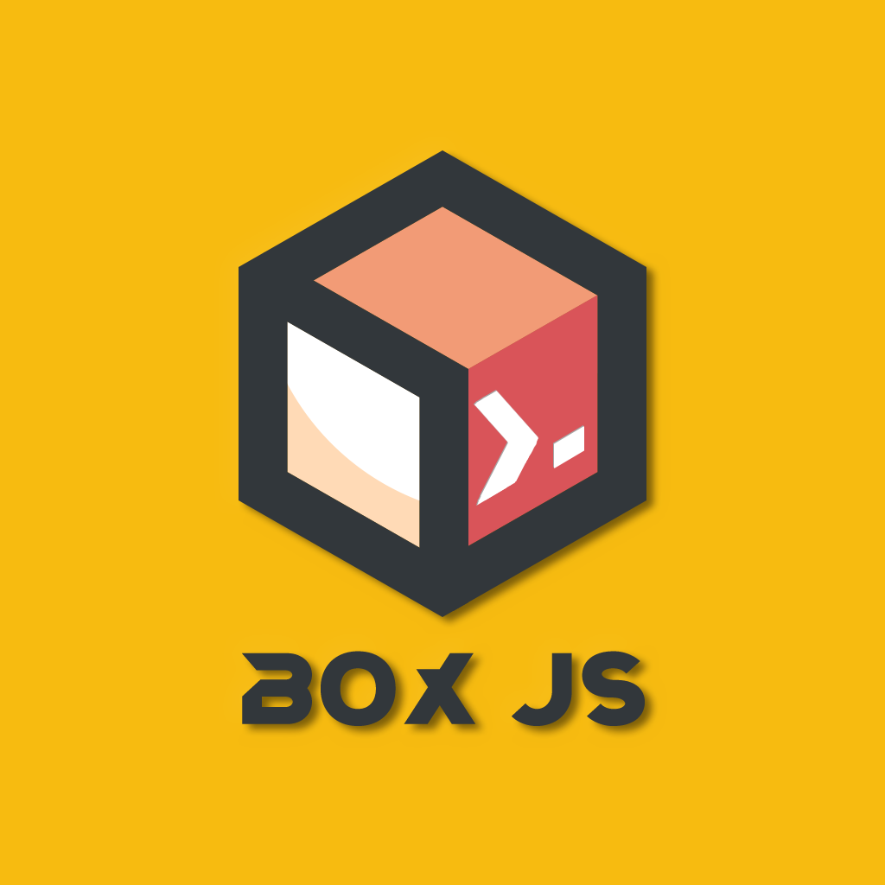

<p align="center">
  <a href="https://github.com/fmz200/BoxJS">
    
  </a>
</p>

# BoxJS


Telegram频道：[奶思🍒资源分享|群组](https://t.me/inaisi_chat)\
Telegram群组：[奶思🍒资源分享|频道](https://t.me/inaisi)

---


- [🧰BoxJs](#boxjs)
  - [简介](#简介)
  - [使用方式](#使用方式)
  - [安装链接](#安装链接)
    - [正式版](#正式版)
    - [🧪 测试版](#测试版)
    - [🔒 版本锁定](#版本锁定)
  - [🔐 安全机制](#安全机制)
  - [🧑‍💻 开发与发布](#开发与发布)
- [🛠️Env.js](#️envjs)
  - [调用方式](#调用方式)
  - [功能列表](#功能列表)
    - [HttpClient](#httpclient)
    - [持久化数据](#持久化数据)
  - [安装链接](#安装链接-1)
    - [正式版](#正式版-1)
- [📃LICENSE](#license)

---

# 🧰BoxJs

<video src="https://github.com/fmz200/BoxJS/raw/master/BoxJS.mp4" width="30%" height="55%" controls></video>

## 简介
A SPA Application for scripts utils

## 使用方式
安装对应模块/插件后，浏览器访问: [boxjs.com](http://boxjs.com "BoxJs")

## 安装链接

### 正式版
正式版模块在每次发版时自动锁定到最新版本号（内部引用 `@版本号`），安装链接永久有效；
重新安装（或代理工具自动拉取）即升级到最新正式版。

  * Shadowrocket: [boxjs.rewrite.surge.sgmodule](https://github.com/fmz200/BoxJS/raw/master/box/rewrite/boxjs.rewrite.surge.sgmodule "BoxJs")
  * Loon: [boxjs.rewrite.loon.plugin](https://github.com/fmz200/BoxJS/raw/master/box/rewrite/boxjs.rewrite.loon.plugin "BoxJs")
  * Quantumult X: [boxjs.rewrite.quanx.conf](https://github.com/fmz200/BoxJS/raw/master/box/rewrite/boxjs.rewrite.quanx.conf "BoxJs")
  * Surge: [boxjs.rewrite.surge.sgmodule](https://github.com/fmz200/BoxJS/raw/master/box/rewrite/boxjs.rewrite.surge.sgmodule "BoxJs")
  * Stash: [boxjs.rewrite.stash.stoverride](https://github.com/fmz200/BoxJS/raw/master/box/rewrite/boxjs.rewrite.stash.stoverride "BoxJs")

### 🧪 测试版
测试版模块始终引用 master 最新代码，随开发即时更新，适合尝鲜与反馈
（无版本锁定，可能出现未完成功能）。

  * Shadowrocket: [boxjs.rewrite.surge.beta.sgmodule](https://github.com/fmz200/BoxJS/raw/master/box/rewrite/boxjs.rewrite.surge.beta.sgmodule "BoxJs(β)")
  * Loon: [boxjs.rewrite.loon.beta.plugin](https://github.com/fmz200/BoxJS/raw/master/box/rewrite/boxjs.rewrite.loon.beta.plugin "BoxJs(β)")
  * Quantumult X: [boxjs.rewrite.quanx.beta.conf](https://github.com/fmz200/BoxJS/raw/master/box/rewrite/boxjs.rewrite.quanx.beta.conf "BoxJs(β)")
  * Surge: [boxjs.rewrite.surge.beta.sgmodule](https://github.com/fmz200/BoxJS/raw/master/box/rewrite/boxjs.rewrite.surge.beta.sgmodule "BoxJs(β)")
  * Stash: [boxjs.rewrite.stash.beta.stoverride](https://github.com/fmz200/BoxJS/raw/master/box/rewrite/boxjs.rewrite.stash.beta.stoverride "BoxJs(β)")

### 🔒 版本锁定
每次 Release 会附带锁定到对应版本号的 rewrite 模块（`master` 已替换为 `@版本号`），
适合追求稳定的用户；更新需手动安装新版本资产。

  * [最新 Release 资产](https://github.com/fmz200/BoxJS/releases/latest)
  * 资产内含 `SHA256SUMS.txt`，可校验下载文件完整性。

## 🔐 安全机制
* BoxJs 页面通过 `jsDelivr` 按版本加载，`box/chavy.boxjs.js` 内置该页面源码的
  SHA-256 哈希（SRI）。加载后先校验哈希，失败自动回退到 GitHub 同版本源再验一次，
  仍不匹配则拒绝渲染并告警，防止 CDN 或上游内容被篡改。
* 仓库 CI 会校验 `Env.min.js`、内嵌 Env、`chavy.box.js` 与 SRI 哈希的一致性，
  并运行 gitleaks 秘密扫描。
* 如需报告安全问题，请参阅 [SECURITY.md](./SECURITY.md)。

## 🧑‍💻 开发与发布
参见 [CONTRIBUTING.md](./CONTRIBUTING.md)。核心命令：
* `npm run build` — 重建 Env.min.js / box/chavy.boxjs.js / chavy.box.js 并注入 SRI 哈希
* `npm run check` — 一致性校验
* `npm run check:release` — 版本与 release notes 一致性校验
* `npm test` — 单元测试

---

# 🛠️Env.js

## 调用方式
  * Env.min.js放置于嵌入式脚本底端，然后头部调用功能
    ```
    const $ = new Env("你的脚本名称");
    ```

## 功能列表
### HttpClient

  * 支持方法: get, post, put, delete, head, options, patch
    ```javascript
    let option = {
        url: "http://www.example.com/", // URL，必须
        headers: { // 请求头，可选
            "Accept": "*/*",
            "User-Agent": "Mozilla/5.0 (iPhone; CPU iPhone OS 15_1 like Mac OS X) AppleWebKit/605.1.15 (KHTML, like Gecko) Version/15.1 Mobile/15E148 Safari/605.1.15",
            "Content-Type": "application/json; charset=utf-8"
            ""
        },
        body: `auth_key=1234567&source_lang=EN&target_lang=ZH` // 请求体，POST等方法必须，字符串或对象
    }
    let result = $.get(URL<String> or options<Object>, callback(error, response, data)) // 不支持异步
    let result = $.post(URL<String> or options<Object>, callback(error, response, data)) // 不支持异步
    ……

    let result = await $.http.get(URL<String> or options<Object>).then(callback(response))
    let result = await $.http.post(URL<String> or options<Object>).then(response => response.body)
    let result = await $.http.put(URL<String> or options<Object>).then(response => {
        $.log(JSON.stringify(response.headers));
        return response.body
    })
    ……
    ```

### 持久化数据
    ```javascript

    $.getdata(‘chavy’) // 读取持久化数据 (string格式)
    $.setdata(string, ‘chavy’) // 写入持久化数据 (string格式)
    $.getjson(‘chavy’, default_value<String, Object>) // 读取持久化数据 (object格式),当读取失败后返回默认值
    $.setjson(object, ‘chavy’) // 写入持久化数据 (object格式)

    ```

## 安装链接
### 正式版
  * 用于集成:[Env.min.js](./Env.min.js?raw=true "Env.min.js")
  * 便于阅读:[Env.js](./Env.js?raw=true "Env.js")

---
  
# 赞助
  
1. [CloudFlare](https://www.cloudflare.com/)

# 📃LICENSE
Copyright © 2019-present chavyleung. This project is [GPL](https://github.com/fmz200/BoxJS/blob/master/LICENSE) licensed.
